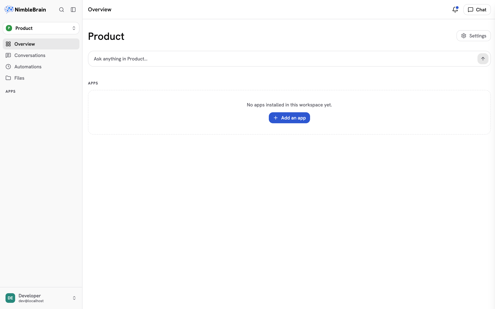

import { Aside } from '@astrojs/starlight/components';

When you sign in to NimbleBrain, you land on the main workspace view. The interface has three main areas.

## Layout overview

### Sidebar (left)

The sidebar is your main navigation. From top to bottom:

- **Logo, search, and sidebar toggle** — The logo returns home. The magnifying glass (`⌘K` / `Ctrl-K`) opens the command palette to jump to anything or run a command. The panel icon (`⌘B` / `Ctrl-B`) collapses the sidebar to icons; when collapsed, click the logo to open it again.
- **Workspace** — The workspace you're in. Click it to switch: type to filter, use the arrow keys, and press Enter. Its menu also opens this workspace's **settings** and creates a **new workspace**.
- **Overview** — The workspace's home: all of its apps.
- **Conversations**, **Automations**, **Files** — This workspace's conversation history, scheduled agent runs, and files.
- **Inbox** — The workspace's notifications: facts its connectors recorded without being asked. The number beside it is how many nobody has read. See [Notifications](/using/notifications).
- **Apps** — Each installed app appears as a sidebar item. Click one to open it in the main content area. An app with more than one view lists them beneath it while it is open.
  Connectors with nothing to open share one row after the apps, which opens the workspace's installed connectors. If you can change the workspace, the **+** beside **Apps** opens the connector catalog to add one.
- **Account** — At the bottom, your name opens **Profile settings**, **Organization** (for admins), and **Sign out**.

The sidebar shows one workspace at a time. Switching workspaces opens the new workspace's overview and re-points every link and the active tool set to it.

### Main content (center)

This area shows whatever you've selected — an app's interface, the home screen, or settings pages. When you click an app in the sidebar, its UI loads here.

A bar across the top names the page you're on. Inside an app that supports it, the name follows you as you go deeper (a contact, then their company), and the levels above it line up before the name; click one to go back there. When the bar is narrow, a back arrow (←) takes you up one level instead. On the right of the bar, **Chat** opens and closes the chat panel. On a phone, the menu button at the bar's left opens the sidebar.

### Chat panel (right)

The chat panel is where you talk to the agent. It floats on the right side and can be:

- **Closed** — Click **Chat** in the top bar (or press `⌘J` / `Ctrl-J`) to open it.
- **Sidebar mode** — A fixed panel alongside the main content. This is the default when you open chat.
- **Fullscreen mode** — Chat takes over the entire content area for focused conversations.

Toggle between these modes with keyboard shortcuts or by clicking the expand/collapse icons in the chat header.

When a tool or app returns a document, the chat shows an artifact chip; clicking it opens the **Artifacts panel** — a slide-out drawer over the content area that shows the full document with copy and download actions. See [Chat](/using/chat#the-artifacts-panel) for details.

<Aside type="tip">
  On mobile devices, the sidebar becomes a slide-out drawer and the chat panel takes the full screen when open.
</Aside>

## Responsive behavior

NimbleBrain adapts to your screen size:

| Screen | Sidebar | Chat |
|--------|---------|------|
| **Desktop** (1024px+) | Full sidebar with labels | Side panel or fullscreen |
| **Tablet** (768–1023px) | Collapsed to icons | Side panel or fullscreen |
| **Mobile** (< 768px) | Hidden, swipe to open | Fullscreen only |
