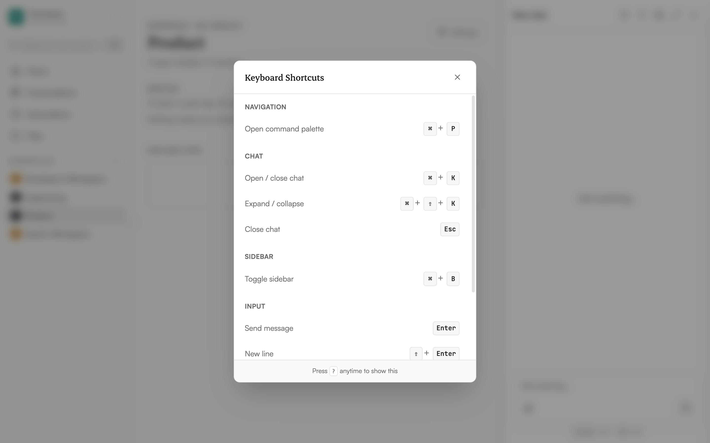

Use these shortcuts to navigate the interface without reaching for the mouse.

## Navigation

| Shortcut | Action |
|----------|--------|
| **Cmd+P** / **Ctrl+P** | Open the command palette |

## Chat

| Shortcut | Action |
|----------|--------|
| **Cmd+K** (Mac) / **Ctrl+K** (Windows) | Open / close chat |
| **Cmd+Shift+K** / **Ctrl+Shift+K** | Expand / collapse chat |
| **Esc** | Close chat |

## Sidebar

| Shortcut | Action |
|----------|--------|
| **Cmd+B** / **Ctrl+B** | Toggle sidebar |

## Input

| Shortcut | Action |
|----------|--------|
| **Enter** | Send message |
| **Shift+Enter** | New line (without sending) |
| `/clear` (typed in input) | Start a new conversation |
| **Cmd+V** / **Ctrl+V** | Paste a file from the clipboard as an attachment |

## General

| Shortcut | Action |
|----------|--------|
| **?** | Show keyboard shortcuts |
