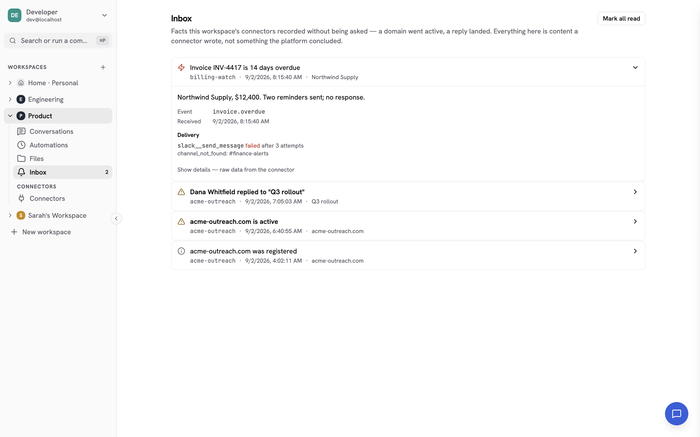
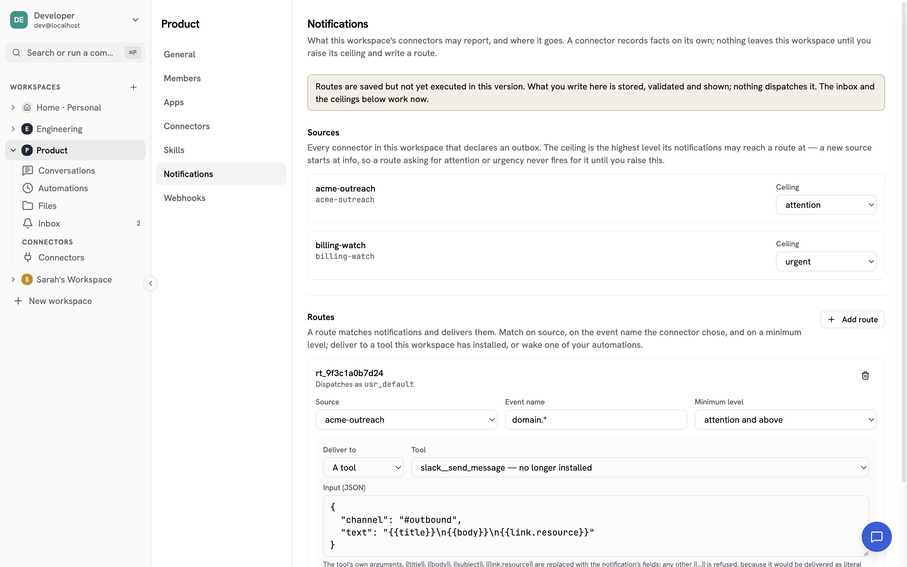

import { Aside } from '@astrojs/starlight/components';

Most of what a connector tells you, it tells you because you asked: you call a
tool, it answers. Some things it learns on its own. A domain it ordered goes
active twenty minutes later. A reply lands on a campaign. A bounce arrives at
three in the morning.

Those arrive as **notifications**. A connector records them in its own outbox,
the runtime reads that outbox on a schedule, and every item lands in the
workspace's **inbox** — visible to anyone who can reach that connector's tools,
and readable by the agent when you ask it what has come in.

Nothing leaves the workspace on its own. Sending an item to Slack, to mail, or
into an agent run is a **route**, and a workspace admin writes it.

## The inbox

Open **Inbox** under the workspace in the left navigation. The count beside it is
how many items nobody has read yet.



Items are grouped by urgency and then by arrival: `urgent` and `attention` sort
above `info`, and within a level the newest is first. Each row carries:

| | |
|---|---|
| **Title** | One line the connector wrote. Bold while unread. |
| **Source** | The connector that emitted it — the same name its tools carry. |
| **Timestamp** | When the connector says the fact happened. The expanded row also shows when this runtime received it. |
| **Subject** | What the item is about, when the connector says. Free text, used for grouping. |
| **Level** | `info`, `attention` or `urgent`. Advisory — the connector chose it. |

Open a row to see the **body** and the event name. Opening an item marks it read;
**Mark all read** clears the rest.

**Read state is shared across the workspace.** A notification is something a
connector recorded, not a message addressed to a person, so the inbox is one
queue the whole workspace works through: when anyone opens an item it is read
for everyone, and the row records who. If you want a per-person copy, a route
is what makes one.

<Aside type="caution" title="Everything in the inbox is content a connector wrote">
Titles, subjects and bodies are text from a third-party server, and the platform
renders them as text: no formatting, no markup, and no clickable link built out
of a URL a connector supplied. A **Linked resource** is shown so you can read it
and decide; it becomes a link only where the platform itself can open it. Treat
what an item says the way you would treat an email from outside your
organization — as a report, not an instruction.
</Aside>

Under **Show details** is the connector's own structured payload, as raw JSON.
The runtime never reads a field of it; it is passed through untouched, and shown
here so you can see what the connector actually sent.

The inbox holds 90 days. The view shows the most recent 100 items; ask the agent
for older ones ("what notifications came in last month from acme?") and it walks
the backlog forward.

### Live updates

The inbox updates itself while it is open, and re-reads the list whenever the
event stream reconnects — the stream does not replay what it missed, so the
re-read is what keeps a tab left open through a restart from showing a stale
list.

## Sources and the level ceiling

**Settings → Notifications** lists every connector in the workspace that
declares an outbox, with the level ceiling it is held to. Workspace admins only.



A newly declared source starts at **`info`**. Because a route matches on level as
a *minimum*, a route looking for `attention` or above never fires for that source
until an admin raises its ceiling. That is deliberate: installing a connector
that declares an outbox costs you a poll and some inbox rows, and it should not
also be a decision to let that connector reach your phone. Raising the ceiling is
the second, separate decision.

Lowering a ceiling does not hide anything — every item still lands in the inbox
at the level the connector chose. The ceiling decides only how high an item may
reach a **route**.

A ceiling you set for a connector that has since been removed stays listed, so
you can still see and lower it. Re-installing the connector lands straight back
on it.

## Routes

A route says: when a notification matches, deliver it there.

Routes that deliver to a **tool** run. Routes that wake an **automation** are
matched and recorded, and nothing runs them yet — the settings tab says so, and
the item's delivery ledger shows those targets as *waiting for the automation
trigger*.

### Match

All three parts are optional, and an empty match is every notification the
workspace receives — legal, and rarely what you want.

| Field | Means |
|---|---|
| **Source** | Exactly one connector, by its exact server name. Omit for any. |
| **Event name** | A glob over the event name the connector chose, e.g. `domain.*`. Omit for any. The names are the connector's own; its documentation lists them. |
| **Minimum level** | `attention` also matches `urgent`. Omit for any level. |

The event-name glob has two wildcards, and the difference between them is
whether a dot may be crossed:

| Pattern | Matches | Does not match |
|---|---|---|
| `domain.active` | `domain.active` | anything else |
| `domain.*` | `domain.active`, `domain.pending` | `domain.dns.ready`, `domain` |
| `domain.**` | `domain.active`, `domain.dns.ready` | `domain` |
| `*.received` | `reply.received` | `mail.reply.received` |
| `**` | every name | — |

`*` matches within one dotted segment; `**` matches across as many as it likes.
Nothing else is a wildcard — a pattern is otherwise matched as literal text, so
a `.` means a dot and not "any character".

**The level a route matches against is the clamped one.** If the source's
ceiling is `info` and the connector sent `urgent`, a route asking for
`attention` does not fire. The item still shows in the inbox at `urgent`, and
its expanded row says which level it was **routed at**.

### Deliver to a tool

Pick any tool installed in this workspace and give it the arguments its own
schema expects, as a JSON object. A tool the workspace does not have is refused
when you save.

Four placeholders are replaced with the notification's fields:

| Placeholder | Value |
|---|---|
| `{{title}}` | The item's one-line title. |
| `{{body}}` | Its body, if the connector wrote one. |
| `{{subject}}` | What it is about, if the connector said. |
| `{{link.resource}}` | The linked resource URI, if the connector supplied one. |

```json
{
  "channel": "#outbound",
  "text": "{{title}}\n{{body}}\n{{link.resource}}"
}
```

Those four are the whole list. There is no placeholder for the connector's
`data` payload, because the runtime does not read it. Any other `{{…}}` is
refused when you save rather than delivered as literal braces in somebody's
Slack channel.

A placeholder the connector left empty — `{{body}}` on an item with no body —
renders as nothing. There is no logic: no conditionals, no loops, no defaults.
Whatever the connector wrote is inserted as text, and the tool decides what
text means.

<Aside type="caution" title="A delivery can happen twice">
A call that times out may have run anyway; the platform only knows no answer
came back, so it retries. If you route to a tool that is not safe to repeat —
one that mints, rotates, charges, or sends something a person will read twice —
write the route knowing that. Retries are bounded (below), which limits the
damage but does not remove it.
</Aside>

### Deliver to an automation

Pick one of your [automations](/using/automations) and the route wakes it, handing
it the matched notifications as its input.

### Who a route runs as

Every route carries an author, and it dispatches under that person's identity —
their workspace membership, their connector grants, their audit trail. The
editor shows it as **Dispatches as**.

The author is stamped from whoever saved the route; it cannot be supplied, and
there is no field for delivering "as" somebody else. Saving replaces the
workspace's whole route list and stamps you as the author of every route in it,
including ones you did not change. That is the safe direction: an admin who
could edit another admin's route while keeping their principal could reach tools
their own grants do not.

If a route's author later leaves the workspace, the route stops firing rather
than dispatching as nobody. Re-adding them restores it.

## The delivery ledger

Once a route has matched an item, the expanded row shows one line per target:
what it aimed at, where it stands, how many attempts it took, and the last
error if there was one. Items no route matched show nothing.

That ledger is the point of routing being visible at all. A notification that
reached the inbox and never reached the Slack channel it was routed to looks
exactly like one nobody routed, unless the attempt was recorded.

| Line reads | Means | Retries? |
|---|---|---|
| **sending** | An attempt is in flight or the next one is due. | yes |
| **delivered** | The tool ran and did not report a failure. | — |
| **waiting for the automation trigger** | An `automation` target. Recorded, not run. | — |
| **refused** | A permission gate said no — the author may not use that tool, or its connector grant is missing. | no |
| **skipped** | The route's author is no longer a member of this workspace. | no |
| **failed** | The call did not complete and the retry budget is spent. | no |

**A target gets three attempts across about five minutes** — immediately, a
minute later, and four minutes after that — and then reads *failed*. That is
long enough to ride out a connector restart or a brief outage upstream, and
short enough that you learn the answer while you are still looking. The
platform never retries a *refused* or *skipped* target: nothing about those
changes until the configuration does.

Retry state lives on the item itself, so a platform restart mid-delivery picks
up where it left off, and nothing already delivered is sent again.

### When a route stops firing

Two things make a route dormant without deleting it, and both say so where you
can see them:

- **Its author left the workspace.** The route shows **Not dispatching** in the
  editor with the reason, and each matched item records *skipped*. Re-adding
  them turns it back on by itself; nothing needs saving.
- **The source ceiling is below what the route asks for.** No ledger line is
  written at all, because no route matched. The item's expanded row shows the
  level it was routed at.

## What the agent sees

The agent reads the inbox when you ask it to, through `notifications__list`, and
can mark items read. It is framed as untrusted content from a connector — the
same footing as any tool result.

Inbox content is **not** injected into the agent's context on its own. Nothing a
connector emits reaches a conversation unless somebody asked for it.

The settings on this page are operator configuration and the agent cannot reach
them: it cannot raise a ceiling and it cannot author a route.

## Related

- [Notifications for app authors](/apps/notifications) — declaring an outbox,
  the event envelope, and the levels, from the connector's side.
- [Connectors](/using/connectors) — installing the connector a route delivers through.
- [Personal connectors](/using/personal-connectors) — what a `my_` tool in a route needs.
- [Workspaces](/using/workspaces) — who can see and configure what.
- [Automations](/using/automations) — what a route can wake.
- [workspace.json](/config/workspace-json) — where the ceilings and routes are stored.
