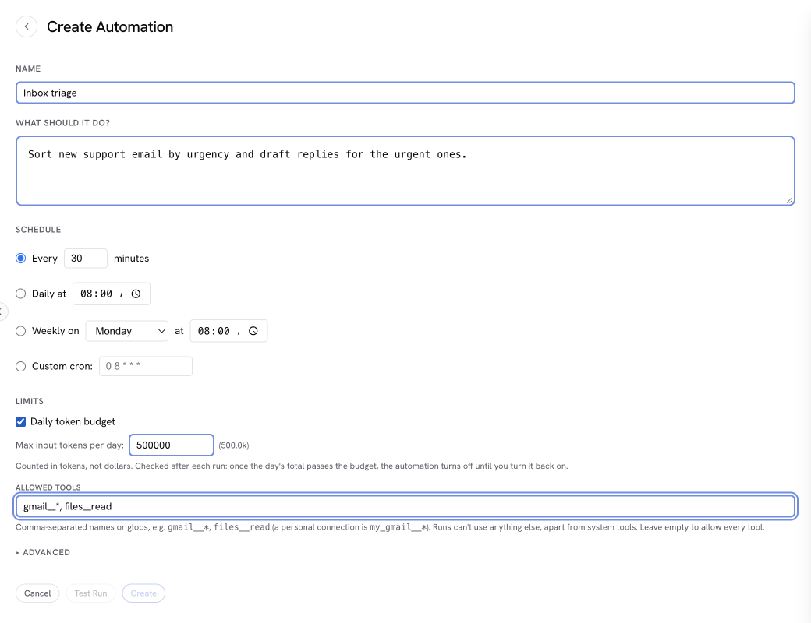

import { Steps, Tabs, TabItem, Aside } from '@astrojs/starlight/components';

Tasks are unattended agent runs. Instead of you typing a prompt, NimbleBrain runs a saved prompt on a schedule — a daily digest, a recurring report, a periodic check — or when a connector reports something worth acting on, and the agent executes it unattended, with access to your tools and connectors.

Each task is a prompt plus an optional schedule. When it fires, or when you run it, the runtime starts an agent run framed around producing a deliverable rather than a back-and-forth conversation.

<Aside type="note" title="The automations names">
The `automations__*` tools still work for a deprecation window: each runs its `tasks__*` twin, under the same rules, and is not listed. Task handles minted under the old name still resolve, and storage written under `workspaces/<wsId>/automations/` moves to `tasks/` when the runtime starts.
</Aside>

## What a task is

A task has:

- **A name** — becomes a kebab-case ID (for example, "Weekly Report" → `weekly-report`)
- **A prompt** — the instruction sent to the agent on each run
- **A schedule (optional)** — a cron expression, a fixed interval, one date and time, or a set of notifications to run on. With none, it runs only when you run it
- **Optional run-time policy** — a model override, a forced skill match, iteration and token caps, a token budget, and the tools it may use

## Who a task runs as

Each task is **owned by a workspace and a user** — it lives at `workspaces/<wsId>/tasks/<ownerId>/`, and that path is the wall. A scheduled run fires as its owner, focused on the workspace it was created in, and is walled to that **provenance workspace**: it reaches only the tools and connectors installed there, with no reach into the owner's other workspaces.

This has one practical consequence: if a task needs to reach a connector (for example, to post to Teams or Slack), that connector must be installed in the **same workspace the task was created in**. A connector connected only in another workspace is never reachable by that task, and a run that tries is recorded as a failure.

<Aside type="note">
Task runs use your **timezone** for cron scheduling. The default is `Pacific/Honolulu`, overridable by the operator with the `NB_TIMEZONE` environment variable. A schedule can also carry its own IANA timezone.
</Aside>

## Schedules

Four schedule types, or none:

- **Cron** — a standard 5-field cron expression (for example, `0 9 * * 1` for 9:00 AM every Monday). An expression that matches no future date, such as `0 9 31 2 *` (February 31), is refused, since it would never run
- **Interval** — a fixed interval in milliseconds, minimum 60000 (one minute)
- **Once** — one date and time, given as an ISO-8601 timestamp with an offset (for example, `2026-07-01T13:12:00-07:00`). See [Running once at a set time](#running-once-at-a-set-time)
- **Event** — no time at all: the task runs when a notification reaches it
- **No schedule (manual only)** — nothing runs it on its own; it runs only when you, or the agent, run it. Use it for a saved procedure you run on demand

Pausing and resuming (`enabled`) controls only the schedule. Run now works whatever the schedule and whether or not the task is paused, subject to its token budget.

### Running once at a set time

A **once** schedule is for a single action at a known time: send this email at 1:12 PM on July 1. Do not write that as a cron with a fixed date (`12 13 1 7 *`): a cron recurs, so that one runs again every July 1.

- **It fires once at its time**, then the task turns itself off and has no next run. This happens whatever the run's outcome (success, failure, or timeout), so no cleanup step is needed in the prompt. The definition and its run history stay, and the task shows as **Ran once at …**.
- **A time that passes while the runtime is down** fires as soon as the runtime is back if it is at most an hour late. Later than that, the occurrence is recorded as skipped, the task turns off, and it shows as **Missed its time**.
- **A time that comes while every run slot is busy** waits for a slot, like any scheduled run, and fires when one frees, however long that takes.
- **The time must be in the future** when you create the task or change its time. A time with no offset is refused, since it means a different moment on every server.
- **To run it again**, give it a new time: that re-arms it and turns it back on. Resume alone does not, since its time has passed. Run now runs it immediately and leaves its schedule as it was.

## Run slots and the queue

The runtime runs a fixed number of unattended runs at once across all of its workspaces: two by default, set by the operator with [`automations.maxConcurrentRuns`](/config/nimblebrain-json/#automations). Scheduled runs, Run now, event runs, and any other run started without a person in the loop all share those slots. Chat is not limited by them.

- **A scheduled run** that comes due while every slot is busy waits for a slot and then runs, oldest due first, so a tightly spaced batch runs late rather than being dropped. Its place is held by its next-run time, so it survives a restart.
- **A Run now or an event run** that arrives while every slot is busy joins a queue and starts when a slot frees. A freed slot goes to the waiting run whose workspace holds the fewest slots, and to the oldest among equals, so one busy workspace cannot keep another waiting; a workspace with no one else waiting uses every slot. Run now answers at once that the run is queued and at what position in arrival order. A queued run gets a freed slot before a waiting scheduled run does.
- **The queue is bounded**: 50 runs by default ([`automations.maxQueuedRuns`](/config/nimblebrain-json/#automations)). A run that arrives when it is full is not started and is recorded as skipped, with the reason.
- **One run per task.** A Run now or event run for a task that already has a run in flight or queued is recorded as skipped.
- **Cancel** stops a run in flight, or removes a queued one and records it as cancelled.

<Aside type="caution">
The queue is held in memory. Runs still queued when the runtime stops are recorded as skipped, and a process that is killed outright loses them with no record. Run them again once it is back.
</Aside>

## Running on an event

A connector can record facts nobody asked for — a domain went active, a reply
landed, a payment bounced — and those arrive in the workspace [inbox](/using/notifications).
An **event** task runs when one of them reaches it.

Two things have to agree before a single run happens, and they are written by
different people:

<Steps>

1. **A workspace admin writes a delivery route** in workspace settings that
   matches some notifications and delivers them to this task. Only an
   admin can do this — not the agent, and not a connector. Without a route, an
   event task never runs, however its match is written.

2. **The task's own `match`** says which of the notifications arriving
   down that route it actually wants — by source, by an event-name glob, and by
   a minimum level.

</Steps>

That is the whole of the path from a connector's report to an agent run: an
operator authored both ends of it, and neither half opens it alone.

### What a run receives

Notifications that match within the task's **debounce window** (default 30
seconds) coalesce into one run. A burst of forty bounces is one run with forty
entries in it, not forty runs.

The run opens with an `<event>` block listing them — each item's source, event
name, timestamp, title, subject, body and link. The connector's own structured
payload is **not** included: the runtime does not read it, so it does not put it
in front of the agent either. Everything in the block is data a third-party
server wrote, and the agent is told to treat it that way — something to report
and reason about, never an instruction to follow.

### The fire ceiling

An event task carries **`maxFiresPerHour`** (default 12, maximum 60). If it
fires more often than that in a rolling hour, it is **disabled** — the same way
a task that fails ten times in a row is.

This is not a rate limit, it is a termination proof. Every other bound on an
task caps what one run costs; none of them stops a loop in which the run's
own work produces the event that fires it again, because that loop succeeds
every time. Re-enabling is a deliberate action, like any other auto-disable:
break the loop first.

<Aside type="caution">
A task whose run writes something the same connector reports on is the
loop this ceiling exists for. Keep the ceiling low for anything shaped that way,
and prefer a prompt that reads and classifies over one that writes.
</Aside>

## Creating a task

The simplest way is to ask the agent in chat. Describe what you want and when:

```
Every weekday at 8am, summarize my unread email and post it to the
#daily channel.
```

The agent creates the task for you, generating the schedule and the prompt. You can ask it to list, pause, resume, or delete tasks the same way. A one-time request ("send this at 3pm tomorrow") becomes a once schedule, and a procedure you only want to run on demand ("save this as a task I can run whenever") gets no schedule.

For an event task, describe the trigger instead of a time:

```
When a reply lands in the outbound campaign, read the thread, classify it as
interested / not interested / out of office, and log the classification against
the contact. Don't send anything.
```

The agent will create it with an event schedule — and should tell you that it
will not run until a workspace admin routes those notifications to it.

## Limiting spend and tools

Both limits sit under **Limits** in the create form, and the agent can set them when it creates a task.



- **Token budget** — a cap on the tokens (not dollars) a task's runs use per day or month, or over its lifetime. Every run counts against it, including Run now on a paused task. It is checked before each model call: each step may write only as much as is left of the period's budget, and a run with too little left for another step stops there, as a `failure` whose error says the budget was reached, and keeps what it did before the stop. An enabled task whose run is stopped that way, or whose period total passes the cap, turns off and stays off until you turn it back on. Run now on a paused task whose total passed the cap is refused until the period resets (for a lifetime budget, until you raise it).
- **Per-run caps** — the most iterations, input tokens, and wall-clock time one run may use. The runtime holds every run to its own ceilings (50 iterations and 10 minutes by default, which an operator can lower with the [`automations`](/config/nimblebrain-json/#automations) block, and an input-token ceiling only when the operator sets one). A cap set above a ceiling is lowered to it. A run with no input-token cap of its own runs under the operator's input-token ceiling, or with no input-token cap when none is set. Creating or updating a task reports the caps its runs will actually get, and says when one was lowered.
- **Allowed tools** — tool names or globs the task's runs may use, such as `gmail__*` for a workspace connector's tools, `my_gmail__*` for your personal connection, or `files__read` for a single tool. A run can't activate or call anything outside the list; only `nb__search` and `nb__manage_tools`, which find and activate the listed tools, stay available regardless. Add any other system tool a run needs, such as `nb__use_skill` to load skills or `nb__read_resource` to read a connector's resources. Prefer a `<connector>__*` glob, since a connector can rename its tools. Leave it empty to allow every tool. The list can't include the tools that create, update, or delete tasks.

A shorter tool list also makes each run cheaper, because the model is sent fewer tool definitions.

## Managing tasks

Browse and manage tasks from the **Tasks** panel in the sidebar, or ask the agent in chat. Both surfaces let you:

<Steps>

1. **List tasks** — name, enabled state, schedule, source, last run status, and next run time. Tasks made to be run once with no schedule (one-offs) are kept with their history but left out of the list unless asked for (`kind: "oneoff"` or `"all"`).

2. **Inspect one task** — its full definition (schedule, model, caps, prompt preview) and recent run history with per-run status, start time, iterations, and tool-call counts.

3. **Pause a task** — disable it without deleting.

4. **Resume a paused task** — re-enable it on its existing schedule.

5. **Trigger an immediate run** — bypass the schedule and run now. This runs a paused task too, which is how you test one before enabling it; a paused task is never fired by its schedule or by events. Short runs return the full run record. A run that takes longer than about 30 seconds keeps going in the background: the response says it is still running, and its record appears in the run history when it ends. When every run slot is busy, the response says the run is queued and at what position (see [Run slots and the queue](#run-slots-and-the-queue)).

</Steps>

<Aside type="tip">
Pausing keeps the definition and its run history intact; the scheduler simply skips it. Resume re-enables it on its existing schedule. To remove a task entirely, ask the agent to delete it (run history is preserved even then).
</Aside>

## Running from an MCP client

A remote agent connected to `/mcp/<workspace-id>` runs a task with `tasks__run`. Every call answers with the run's id (`runId`), and `tasks__run_result` with that `runId` alone reads the run's full result once it has ended.

<Steps>

1. **A saved task or an inline one-off.** Pass `name` to run a saved task. Or leave `name` out and pass the definition inline: `prompt` (or `skill`), and optionally `inputSchema`, `outputSchema`, `allowedTools`, `limits` (`maxIterations`, `maxInputTokens`, `maxRunDurationMs`), and `budget` (a token budget). An inline call creates a one-off task with no schedule, owned by you in that workspace, runs it once, and keeps it with its run. Nothing deletes it.

2. **Input.** `input` is any JSON value, at most 64 KiB serialized. When the task has an `inputSchema`, an input that does not match it, or a missing one, is refused before the run starts, with the reasons. The input is kept on the run record and given to the run as data, inside a block the model is told never to follow as instructions.

3. **Output schema.** When the task has an `outputSchema`, the run is told to answer with JSON matching it. The final answer is parsed (a fenced code block is accepted) and checked: the parsed value is kept as the result's `structured`, and the run record says whether it matched (`outputSchemaValid`) and, when it did not, why (`outputSchemaErrors`). A mismatch is recorded, not a failure: the run's status still says how it ended.

4. **Idempotency.** Pass `idempotencyKey` to make a call safe to repeat. A later call with the same key for the same task returns the run the first call started, whether it is still running or has ended, instead of starting another. For an inline one-off the key also names the one-off, so a repeat finds the same one-off and the same run.

</Steps>

### As an MCP task

On the `2026-07-28` protocol, a client that declares the MCP tasks extension (`io.modelcontextprotocol/tasks`) on its call gets a task handle back at once instead of an answer. The handle names the run, and the run's record is written before the handle is returned, so a lost connection or a restart of the runtime does not lose it. Poll it with `tasks/get` and stop it with `tasks/cancel`; only the identity that started the run, in the workspace it started in, can read or cancel it, and anyone else gets "task not found".

| Run state | Task status |
|---|---|
| queued, running | `working` |
| `success`, `degraded`, or a `timeout` that left a partial result | `completed`, with the deliverable and the run record inline |
| `failure`, `skipped`, or a `timeout` that left nothing | `failed`, with the run's reason |
| `cancelled` | `cancelled` |

`tasks/cancel` cancels a queued run or one in flight. When the runtime stops, a run still queued reads `failed` (it never started), and one in flight reads `cancelled`, or `failed` if the process died without stopping.

Task handles are offered on the `2026-07-28` protocol only. On an earlier protocol, or without the extension, `tasks__run` answers as it always has: the run record when the run ends within about 30 seconds, otherwise a `dispatched` or `queued` answer carrying the `runId` to poll with `tasks__run_result`.

## Run history

Every run is recorded with its status, start and completion times, iteration count, tool calls, and any error. View it in the Tasks panel or by asking the agent. If the runtime restarts while a run is in flight, the orphaned run is swept and marked failed so history stays accurate.

Run history, including each run's full result, is kept indefinitely. The most recent 1,000 runs of each task are read by default; older ones, with their results, are kept in monthly archives and read a page at a time: `tasks__runs` with an `automationId` returns a `nextBefore` timestamp when older runs exist, and passing it back as `before` returns the next page.

A run's status comes from what its tool calls did, not from what its final answer says:

| Status | Meaning |
|---|---|
| `success` | The run finished and every failed tool call was later retried to success. |
| `degraded` | The run finished, but at least one tool call failed and no later call to that tool made it good, which usually means part of the work did not happen. The error names each tool and how many of its calls were left failed. Shown as **Finished with errors**. |
| `failure` | The run could not finish, it stopped at its input-token cap or its token budget, a connector it called was unreachable, or a tool it called three or more times never once succeeded. |
| `timeout` | The run hit its duration or iteration limit. |
| `skipped` / `cancelled` | The run did not start (already running or queued, the queue was full, the token budget was spent, or it was still queued when the runtime stopped), or was stopped or removed from the queue. The error says which. |

A failed call counts as retried when a later call to the same tool with the same input succeeds. When a tool succeeded on only one input in the run, a failure before that success counts as an earlier attempt at it, such as a rejected argument the agent then corrected. A later success with different argument names counts too, since that is the corrected form of a call the tool rejected. Only a later call to the same tool counts, so two healthy patterns still read `degraded`: a lookup that fails as not found and is followed by a create on another tool, and a fallback to a different tool after one fails. A degraded run does not count toward the ten consecutive failures that pause a task, and does not delay its next run.

## What's next

- [Chat](/using/chat) — the interactive counterpart to a scheduled run
- [Connectors](/using/connectors) — install the connectors a task posts to in its own workspace
- [Workspaces](/using/workspaces) — workspace ownership and the per-workspace wall
